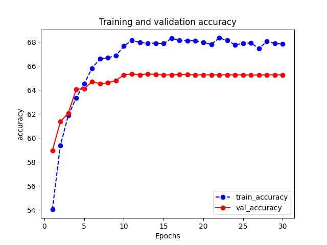
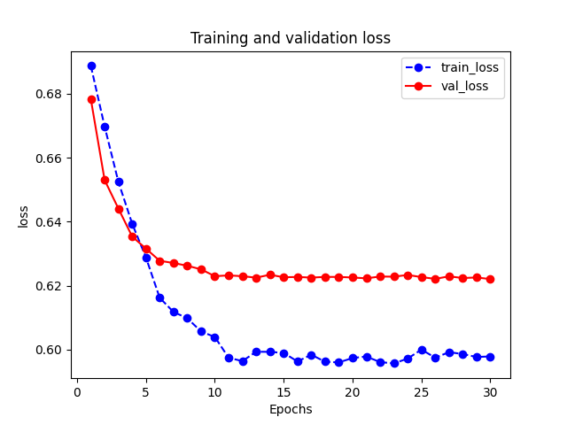
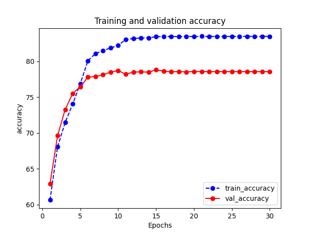
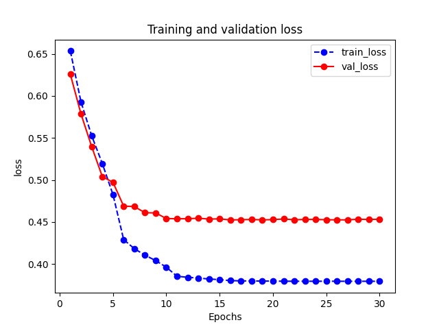
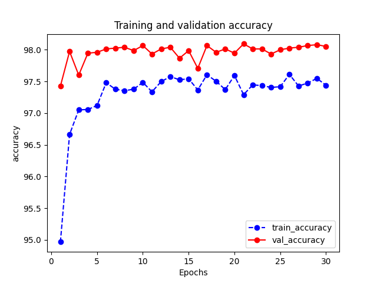
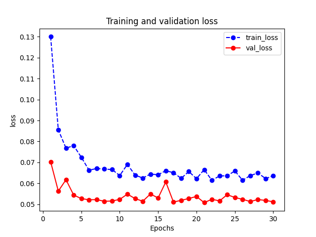
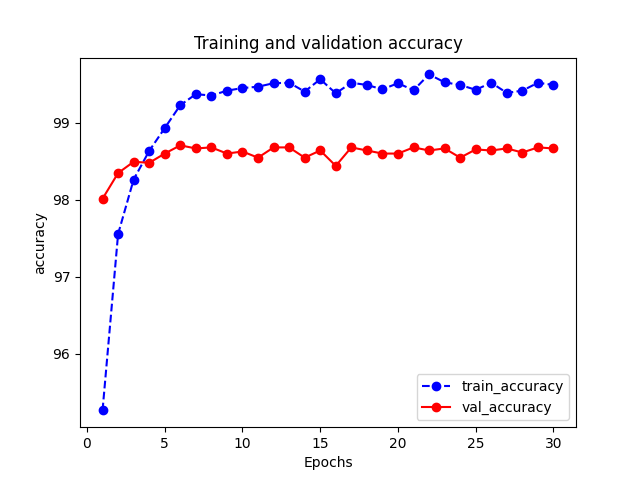
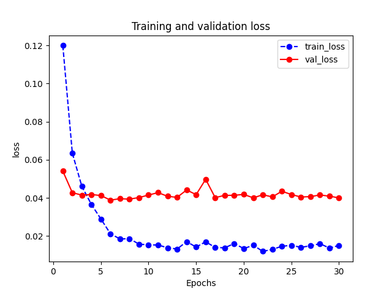

# Cats_Vs_Dogs
使用Pytorch进行猫狗分类

```
数据格式如下：
    ├── train
    │   ├── cat
    │   └── dog
    └── test
        ├── cat
        └── dog
```

### **Step 1**

数据集：[[link](https://www.kaggle.com/datasets/shaunthesheep/microsoft-catsvsdogs-dataset/data)]

cats文件夹下12500张图片：cat_0.jpg~cat_12499.jpg

dogs文件夹下12500张图片：dog_0.jpg~dog_12499.jpg

划分数据集（三七分，也可以采用其他的划分）：

    data
        ├── train
        │   ├── cat
        │   │   ├── cat.0.jpg
        │   │   ├── ...
        │   │   └── cat.8749.jpg
        │   └── dog
        │       ├── dog.0.jpg
        │       ├── ...
        │       └── dog.8749.jpg
        └── test
            ├── cat
            │   ├── cat.8750.jpg
            │   ├── ...
            │   └── cat.12499.jpg
            └── dog
                ├── dog.8750.jpg
                ├── ...
                └── dog.12499.jpg

### **Step 2**

在`option.py`中修改训练集和测试集的地址

```
#  path
self.Train_PATH = "./data/train"
self.Test_PATH = "./data/test"
```

选择你想要的模型

```
#  model 可选：全连接网络，卷积神经网络，迁移学习，迁移学习微调

self.Model = "FullyConnectedNet"
# self.Model = "ConvNet"
# self.Model = "TransLearning"
# self.Model = "TransLearning_adjust"
```

运行

```
python train.py
```

### 不同模型的准确率acc

#### 全连接网络：65.35%

<div style="display: flex;">
    
    
</div>


#### 卷积神经网络：78.80%

<div style="display: flex;">
    
    
</div>


#### 迁移学习：98.10%

<div style="display: flex;">
    
    
</div>


#### 微调：98.71%

<div style="display: flex;">
    
    
</div>